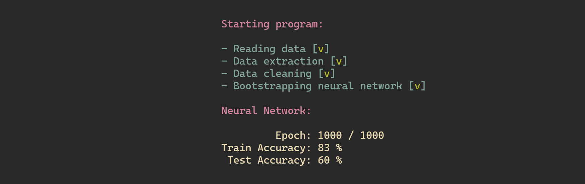

# NN_Implementation

'NN_Implementation' is an exploration of neural network algorithm, without using any external libraries. Implementation is the network with one hidden layer and rigid set of parameters.

Solution works on the specific data set. To run properly, program requires the 'iris.csv' file, to be present in the same directory as the executable. Mentioned file can be found in the main folder of the project.

Each subsequent run of the program will yield different results. The reason is that each time, utilized set is randomly split in to two subsets. Training set, which takes 70% of the original collection of data, and testing set, that takes the remnant of 30%. 

---

### Requirements:
- CMake version >= 3.18.4
- compiler compatible with C++20

---

 